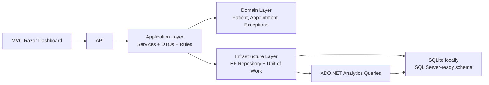

# Healthcare Analytics Platform Architecture

## Layers

- `HealthCare.Domain`: core entities, enums, and business exceptions.
- `HealthCare.Application`: DTOs, service classes, repository interfaces, and use-case rules.
- `HealthCare.Infrastructure`: EF Core DbContext, repository pattern, unit of work, JWT token service, and ADO.NET analytics.
- `HealthCare.Api`: REST controllers, JWT authentication, role-based authorization, MVC/Razor dashboard, routing, CORS, and exception middleware.
- `HealthCareAnalytics.MVC`: standalone UI for login, dashboard, patients, and appointments.

## Design Patterns Used

- Repository Pattern: `IRepository<T>` and `EfRepository<T>` hide EF Core data access from application services.
- Unit of Work: `IUnitOfWork` coordinates patient and appointment repositories and saves changes together.
- Dependency Injection: services are registered in `Program.cs` and `DependencyInjection.cs`.
- DTO Pattern: request/response DTOs avoid exposing EF entities directly from APIs.
- Layered Architecture: domain, application, infrastructure, and presentation responsibilities are separated.

## Security

- JWT authentication is implemented with `/api/auth/login`.
- Role authorization protects create/update/delete operations.
- Model validation uses data annotations on request DTOs.
- Exception middleware returns clean API errors instead of stack traces.

## Azure and Container Strategy

- Backend can be containerized with the root `Dockerfile`.
- Container can be hosted in Azure App Service for Containers.
- Database connection can be moved from SQLite to Azure SQL by changing the connection string and EF provider.
- GitHub Actions workflow restores, builds, tests, and builds Angular.
